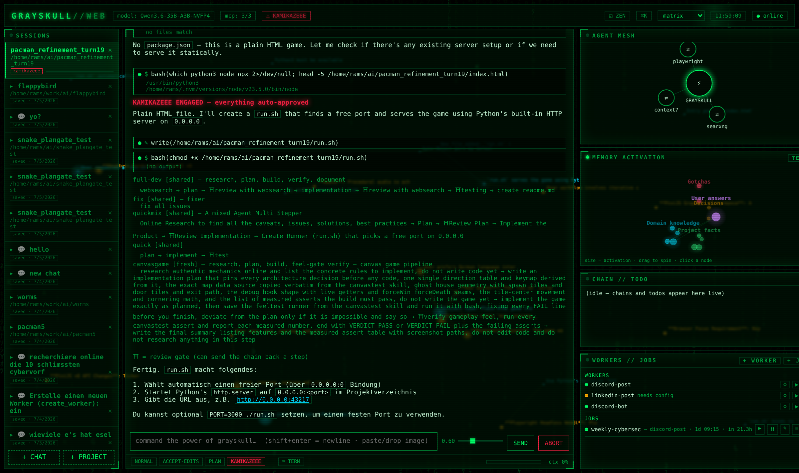
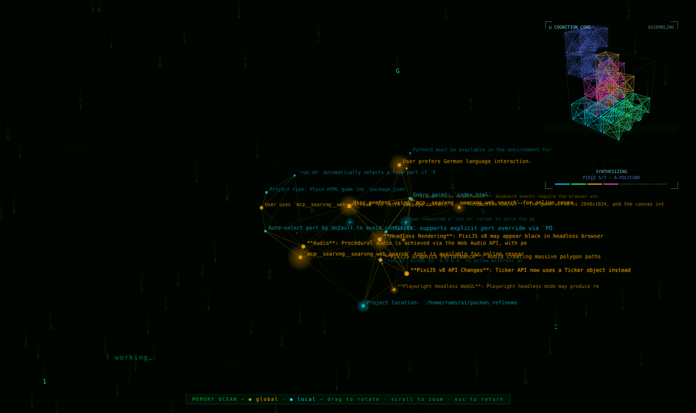
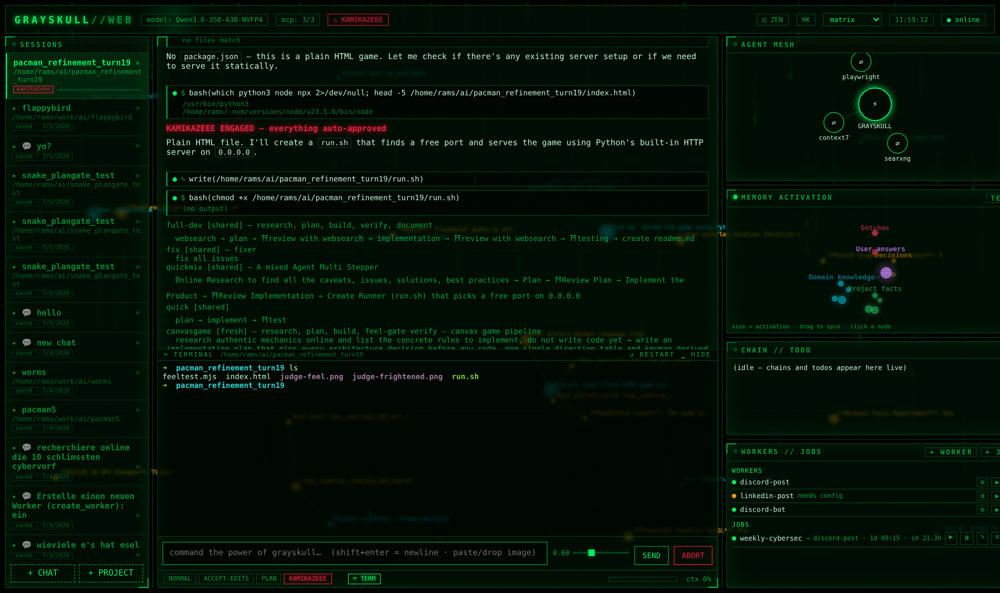

# GRAYSKULL

**BY THE POWER OF GRAYSKULL** — a Claude Code-style terminal agent for **local models,
plural**. Anything that speaks the OpenAI chat API is a first-class citizen: vLLM,
llama.cpp, LM Studio, Ollama, a box across the VPN — all of them side by side. Models
live in a named preset registry (endpoint + family + sampling + context window):
`/model` swaps the whole stack live mid-session, `/setup` adds and edits presets from
a dialog, and thinking chains can pin a *different model per step* — plan on the big
slow one, grind out code on the fast one, gate the review on whichever you trust most.

Ships with presets for a DGX Spark stack (Qwen3.6-35B, Qwen3.5-122B-heretic,
GLM-4.5-Air, small Llama/Nemotron utility models) — keep them, edit them, or point
your own; nothing is hardwired. Model-family profiles (qwen / glm) absorb the dialect
quirks per model: tool-call leak formats, thinking-mode kwargs, chain sampling presets.

Local models are not frontier-smart, so the harness does extra lifting: persistent
two-tier memory with brain-like scoring, ask-back interviews, tool-call repair,
mandatory web verification, stuck-detection with auto web-research, plan-first
blueprint gating, sub-agent fan-out, user-composable thinking chains, image input
(pasted *and* from tool results — the agent sees its own Playwright screenshots),
scheduled unattended workers, a per-session shell in the web UI, a matrix-style web
UI with zen mode, and aggressive context hygiene.



**Start with the web UI.** `grayskull-web` is the intended cockpit: every session, the
agent mesh, the memory graph, chains, workers, a real shell per project — one browser
tab. The terminal client is fully capable and great over SSH, but it also auto-joins a
running web hub, so the honest answer is: run both, look at the web.



## What makes GRAYSKULL different

Most agent CLIs are thin wrappers around a frontier model — the model is smart, the
harness stays out of the way. GRAYSKULL is the opposite bet: **mid-size local models
plus a harness that compensates mechanically.** Everything below exists because an
8B–122B model running on your own hardware needs it — and it's yours, on your box,
with zero cloud dependency:

- **Multi-model by design.** A preset registry instead of one hardcoded endpoint:
  mix vLLM, llama.cpp, LM Studio, Ollama across machines, switch live with `/model`,
  and let a thinking chain use a different model per step. Family profiles keep each
  model's dialect quirks (tool-call leaks, thinking kwargs) out of your way.
- **Memory that behaves like memory.** Two tiers (global vault + per-project),
  auto-distilled after every turn, scored with ACT-R-style activation: memories decay
  exponentially, get reinforced when they fire, spread activation to similar neighbors,
  and are pruned to an archive they can be revived from. Pure code, no LLM in the loop —
  and you can *watch it learn* as a living node graph in the web UI.
- **It notices when it's stuck.** Ten edits without a fix, or you report the same bug
  twice → it stops guessing and researches the problem online. Weak models loop;
  GRAYSKULL breaks the loop mechanically.
- **Thinking chains — structured reasoning you compose.** `/thinkingchain plan -> code
  -> review` runs user-defined step pipelines with PASS/FAIL gates that jump back on
  failure, per-step sampling presets (creative planning, precise coding), per-step
  model binding, shared or fresh context per step. A weak model following a good
  process beats a weak model winging it.
- **It sees its own screenshots.** Playwright screenshots come back as real images to
  the vision model — the agent looks at the rendered page, not just the DOM.
- **Compilers as guardrails.** Every edit triggers the project's typecheck; failures are
  injected straight into the tool result so the model fixes its own breakage in the same
  turn. LSP navigation and current library docs (context7) are always on.
- **Tool-call repair.** Malformed calls, tool calls leaked as text, dialect quirks
  (Qwen JSON vs GLM XML) — validated, recovered, retried with targeted error messages
  instead of dying.
- **Context that survives itself.** At 70% full the agent writes its own continuation
  brief, wipes the window, and keeps working — mid-turn if needed. Long tasks don't
  drown in their own history.
- **An always-on control room.** grayskull-web: multiple live sessions, agent-mesh and
  memory graphs, scheduled unattended workers (post to LinkedIn weekly, watch a feed) —
  and every terminal session auto-joins the hub, steerable from the browser. Plus zen
  mode: GUI fades, the memory ocean rotates, the live thinking ghosts over it, ambient
  audio on. Your agent as an aquarium.
- **KAMIKAZEEE mode.** Fully unattended: never stops at iteration caps, auto-answers
  its own questions. Shift+tab, red-alert theme, matrix rain. You were warned.

One TypeScript codebase, one Bun binary, no cloud, no telemetry, no subscription.

---

## Quick start

**Recommended: the web UI.** One always-on hub, every session in the browser:

```sh
export LMSTUDIO_API_KEY=whatever   # vLLM usually accepts anything
grayskull-web                      # or: bun run web  →  http://localhost:4242
```

Open the page, hit **+ PROJECT**, point it at a directory — full agent with memory,
MCP, permissions, chains, its own shell (⌨ TERM). Everything below in this README
works from there. See [Web UI](#web-ui--grayskull-web) for the tour.

The terminal client for SSH / tmux life:

```sh
grayskull                  # launcher in ~/.local/bin — run it in any project directory
bun run src/index.tsx      # or manually (bun lives in ~/.bun/bin)
```

It auto-joins a running grayskull-web hub, so browser and terminal mirror each other.
Build standalone binaries (no bun at runtime): `bun run build` → `dist/grayskull`,
`bun run build:web` → `dist/grayskull-web`.

First useful thing to type: `/init` — it explores the project, asks you 2-3 questions,
and seeds the project memory.

### Reference deployment: three models resident, systemd-managed (DGX Spark)

The reference stack runs **three vLLM containers concurrently** — the GPU memory is
split so all of them stay resident and `/model` switches instantly, no load wait:

| port | service | model | ctx | tool parser | gpu-mem |
|---|---|---|---|---|---|
| 8000 | `qwen-vllm` | Qwen3.6-35B-A3B-NVFP4 (main) | 262144 | `qwen3_xml` | 0.21 |
| 8001 | `vllm-llama` | Llama-3.1-8B-Instruct-NVFP4 | 131072 | `llama3_json` | 0.20 |
| 8002 | `vllm-nemo` | Nemotron-Nano-9B-v2-NVFP4 | 8192 | `qwen3_xml` | 0.16 |

Each is a systemd unit wrapping `docker run` on `vllm/vllm-openai:nightly-aarch64`
(`Restart=always`, HF cache bind-mounted, `HF_TOKEN` from `/etc/vllm/vllm.env`).
The main Qwen3.6 unit, trimmed to the interesting flags:

```ini
[Service]
ExecStart=/usr/bin/docker run --rm --name qwen-vllm \
  --gpus all -p 8000:8000 \
  vllm/vllm-openai:nightly-aarch64 \
  nvidia/Qwen3.6-35B-A3B-NVFP4 \
  --host 0.0.0.0 --port 8000 \
  --kv-cache-dtype fp8 \
  --attention-backend flashinfer --moe-backend marlin \
  --gpu-memory-utilization 0.21 \
  --max-model-len 262144 --max-num-seqs 4 --max-num-batched-tokens 8192 \
  --enable-chunked-prefill --async-scheduling --enable-prefix-caching \
  --speculative-config '{"method":"mtp","num_speculative_tokens":3,"moe_backend":"triton"}' \
  --load-format fastsafetensors \
  --reasoning-parser qwen3 --tool-call-parser qwen3_xml --enable-auto-tool-choice
```

The heavier one-at-a-time models (Qwen3.5-122B-heretic, GLM-4.5-Air) still exist as
spark-vllm-docker recipes — launching one replaces the resident trio, and their
`/model` presets are kept in settings for exactly that.

Flag notes, whatever backend you run:

- `--enable-prefix-caching` matters most: grayskull keeps system prompt + memory as a
  stable prefix, so every turn after the first reuses the KV cache.
- `--reasoning-parser qwen3` splits think-blocks into a separate stream — grayskull
  renders them dimmed and never parses tool calls out of them; thinking is off by
  default (`"enableThinking": false` flips it via `chat_template_kwargs`, or `/thinking`
  live).
- `--tool-call-parser` must match the model family (`qwen3_xml` for Qwen-likes,
  `llama3_json` for Llama) — grayskull's leak recovery handles the stragglers either
  way, but the parser does the bulk of the work.
- MTP speculative decoding (`--speculative-config`) is transparent to grayskull;
  on this build `reasoning_content` stays empty and answers arrive in `content`.

---

## Keys

| key | action |
|---|---|
| `shift+tab` | cycle permission modes |
| `@` | fzf file picker — inserts the picked path into your prompt |
| `←` / `→`, `ctrl+a` / `ctrl+e` | move the cursor within the prompt / jump to start / end |
| `↑` / `↓` | browse previous prompts (shell-style, persisted per project) |
| `1`-`9` | answer a model question by picking an option |
| `y` / `a` / `n` | permission prompt: yes / always this session / no |
| `esc` | interrupt the running turn / chain step |
| `ctrl+c` | quit |

**Pasting:** a large or multi-line paste is collapsed to a `[#N pasted … lines]`
placeholder in the input (the full text is restored when you send) — so big pastes
don't flood the prompt. **Images:** put an image file path in your prompt (type it, paste
it, or pick it with `@`) — `.png/.jpg/.jpeg/.gif/.webp/.bmp` files are read and sent as
image parts to the (vision-capable) model; `@clipboard` grabs the clipboard image where a
graphical session + `wl-clipboard`/`xclip` is available. In the **web UI** you can paste
or drag-drop an image straight into the prompt.

**Steering a running task:** anything you type while the model is working queues as a new
turn (runs after). To change course *without waiting* or hitting `esc`, use
**`/inject <message>`** — it's folded into the live tool loop at the model's next step, so
it adjusts mid-task (e.g. `/inject reuse the helper in utils.ts, don't write a new one`).
A `↪ steering` note shows when it lands. Works in the terminal and the web UI.

## Permission modes (shift+tab)

| mode | behavior |
|---|---|
| `normal` | reads are free; edits and commands prompt, with a diff preview for edits |
| `accept-edits` | file edits auto-approved; bash still prompts (unless allowlisted) |
| `plan` | read-only; the model presents a plan, you switch modes to execute |
| `KAMIKAZEEE` | everything auto-approved. Red banner. You were warned. |

Allowlists/denylists in settings skip prompts permanently, Claude Code syntax:

```json
"permissions": { "allow": ["bash(git *)", "bash(ls*)"], "deny": ["bash(rm -rf*)"] }
```

Answering `a` (always) at a prompt allowlists that tool for the session.

## Built-in tools (what the model can do)

`bash` (full GNU userland, git, fzf), `read`, `write`, `edit` (exact-string replace,
diff previews), `grep`, `glob`, `ask_user`, `todo`, `skill`, `create_agent`,
`spawn_agent`, plus everything MCP servers provide.

Weak-model armor: every tool call is schema-validated; invalid calls get an actionable
error fed back (max 3 repair attempts), and tool calls the model emits as plain text
(```json blocks / `<tool_call>` leakage) are detected and recovered.

`ask_user` is first-class: the system prompt orders the model to ask you 1-3 concrete
questions *before* working when requirements are ambiguous — answers flow into project
memory, so it gets smarter about your domain with every question.

---

## Memory (two tiers)

**Global vault** — `~/.config/grayskull/GRAYSKULL.md`. Applies to every project. Updated
**only** when you explicitly say so: phrases like *"always remember …"*, *"from now on
always …"*, or the `/remember <fact>` command. Never auto-written.

**Project memory** — `.grayskull/memory.md`. Updated **automatically after every turn**
by a background extraction pass. Sections: project facts, domain knowledge, decisions,
user answers, gotchas. Capped (~3k tokens, configurable); compresses itself when over.

**Knowledge distillation**: when a turn used web search/fetch, the useful external
knowledge (API signatures, versions, config syntax) is distilled into project memory —
so the model doesn't re-search the same things next time.

**Brain-like scoring** (project memory only): every fact carries an activation score
modeled on human memory (ACT-R style):

- **decay** — scores halve every `halfLifeDays` (default 7) without use (forgetting curve)
- **reinforcement** — facts a turn actually touches get `+1` (capped at 3)
- **spreading activation** — the top-3 lexically similar neighbors of a used fact get a
  smaller boost too (`spreadFactor`, default 0.25): related knowledge stays warm
- **archive, not delete** — facts fading below `pruneThreshold` (0.15) move to
  `.grayskull/memory-archive.md`; if a later turn strongly matches an archived fact
  (`reviveThreshold` 0.55) it is **revived** at medium strength — forgotten, not destroyed
- strongest facts are injected first; over the token budget the weakest are dropped from
  the prompt (the file keeps them)
- the global vault is **exempt** — "always remember" never decays
- kill switch: `"memory": { "scoring": false }`

Both memories are injected into the system prompt every turn and survive context
compaction — that's what makes compaction safe.

```
/memory                # show both, with activation scores
/memory archive        # show faded (archived) facts
/memory edit [global]  # open in $EDITOR
/remember <fact>       # write to the global vault
/forget <pattern>      # prune project memory lines
```

## Settings (global + local)

Precedence: built-in defaults < `~/.config/grayskull/settings.json` <
`./.grayskull/settings.json`. Edit with `/settings` (global) or `/settings local`.

Covers: `baseURL`, `model`, `modelFamily`, `models` (named `/model` presets),
`contextWindow` (262144 on the qwen3.6 default), `maxTokens`, sampling (`temperature`,
`topP`, `topK`, `minP`, `presencePenalty`, `repetitionPenalty`), `enableThinking`,
`compactThreshold`, `defaultMode`, `editor`, `agentConcurrency`, `memory` (enabled /
maxTokens / globalTriggers / scoring knobs), `diagnostics`, `permissions` (allow/deny),
`mcpServers`.

**System prompt**: `/system` opens the global one (`~/.config/grayskull/system-prompt.md`)
in `$EDITOR`; `/system local` creates/edits a per-project prompt that is *appended*
(set `"replaceSystemPrompt": true` in local settings to replace instead).

## /setup — endpoints, LLM presets & service health

`/setup` opens a setup dialog instead of hand-editing JSON — keyboard-driven in the
terminal (↑↓ select, enter edit, esc close), a modal in the web UI (same data, same
live behavior):

- **Full LLM configs, grouped** — the ACTIVE MODEL section and one section per
  `/model` preset, each with the complete stack: **family** (qwen3.5/glm4.5 —
  selects the tool-call format and thinking presets), **endpoint**, **model id**,
  **api key env** (shows whether the env var is actually set), context window,
  max output tokens, temperature/top_p/top_k, thinking on/off. Field types are
  real: enums cycle (dropdowns in the web), toggles flip, numbers validate.
- **Applied live** — committing an ACTIVE MODEL field takes effect immediately
  (endpoint/key changes reconnect the client, the searxng URL restarts its MCP
  bridge) — no restart. `s` (or SAVE in the web) persists the edited fields into
  the global `settings.json` (only what you changed is written).
- **Add / remove LLMs** — `a` adds one (cloned from the active stack, then adjust
  family/endpoint/model id per field), `x` removes the selected one; in the web
  modal use + ADD LLM and ✕ REMOVE per section. Grayskull's seeded defaults
  (qwen35, glm, …) are removable too: saving writes the whole preset list to
  `settings.json`, which then owns it — deleted defaults stay gone across restarts.
- **Extendable** — the fields of an LLM are one spec table in `src/setup/core.ts`
  (`PRESET_SPEC`/`ACTIVE_SPEC`); adding an entry there surfaces it in the TUI
  dialog, the web modal and persistence automatically.
- **Service health** — live status for **searxng**, **context7**, **lsp-ts** and
  **playwright**: MCP bridge state, tool counts, and real checks behind them — the
  searxng *instance* is probed over HTTP (the bridge connects happily while the
  instance is down), the lsp binaries (`mcp-language-server`,
  `typescript-language-server`) are looked up on disk/PATH, playwright's config
  presence is verified. Anything missing or failed shows concrete fix instructions
  inline (the `docker run` for searxng, the `go install`/`npm i -g` lines for LSP,
  the settings snippet for playwright). `r` reconnects failed servers and re-runs
  all checks.

## Web search + fetch (always on)

searxng on `:8080`, bridged through the `mcp-searxng` stdio MCP server — a built-in
default, no setup needed. Two tools: `searxng_web_search` and `web_url_read`. The system
prompt makes the model **fetch** the top results after searching instead of trusting
snippets, and fetched knowledge feeds the memory distiller.

## MCP servers

Declared in settings (global or per project):

```json
"mcpServers": {
  "searxng":  { "type": "stdio", "command": "npx", "args": ["-y", "mcp-searxng"],
                "env": { "SEARXNG_URL": "http://127.0.0.1:8080" } },
  "somehttp": { "type": "http", "url": "http://localhost:9000/mcp" }
}
```

Tools appear to the model as `mcp__<server>__<tool>`. `/mcp` shows status,
`/mcp reconnect <name>` reconnects. Connection failures are reported, never fatal.

**MCP image results reach the model as images.** Tool results containing image
content (e.g. a Playwright screenshot) are forwarded as data URIs and attached to
the conversation as `image_url` parts — the chat API's tool role is text-only, so
they ride a follow-up user message. With a vision-capable served model the agent
actually *sees* what it screenshots; compaction replaces old image parts with
`[image]` placeholders so base64 never bloats summarizer prompts.

## Code intelligence (always on, full auto)

Three layers that catch weak-model mistakes mechanically:

- **Auto-diagnostics** — after every `edit`/`write` the project's check runs and failures
  are injected into the tool result, so the model fixes its own breakage in the same
  turn. Auto-detected per project: `typecheck` script → `bunx tsc --noEmit` →
  `cargo check` → `go vet` → `ruff`; override or disable via
  `"diagnostics": { "command": "...", "enabled": false }` in local settings.
- **LSP (mcp-language-server)** — semantic navigation: `definition`, `references`,
  `hover`, `rename_symbol`, `diagnostics`, `edit_file`. Attaches automatically per
  project type (`lsp-ts` when a `tsconfig.json` exists, `lsp-go` for `go.mod`) — the
  `if` field on any MCP server config gates it on a marker file, and `${cwd}` in args
  resolves per session. The system prompt steers the model to LSP over grep.
- **Context7** — current, version-specific library docs (`resolve-library-id` →
  `get-library-docs`); kills stale-API hallucinations and feeds the memory distiller.
- **Stuck detection → auto web-research** — pure-code tracker (`agent/stuck.ts`):
  after 10 edits without resolving the problem, or when you report the same problem
  a second time (lexical similarity between problem-looking prompts), a one-shot
  nudge is injected telling the model to stop guessing and research the problem
  online (searxng) first. Config: `"stuckResearch": { "enabled", "editThreshold",
  "repeatThreshold" }`.

## Visual-verification gate

Weak models fix rendering bugs blind: edit, re-read their own edit, declare "fixed" —
without ever rendering a frame. GRAYSKULL blocks that mechanically (`agent/visual.ts`):
when a turn is **visual** (the prompt carries an image or rendering vocabulary —
clipping, overlap, drawn, canvas, sprite, … en/de) and the model **edited code but
never observed the result** (no playwright call *after* the last edit), the tool loop
refuses to end the turn once and injects the procedure instead: start the app, load it
headless, click the canvas (WebGL wake-up), **assert the complaint numerically** via
`browser_evaluate` (adding a `window.__game`-style debug hook to the code if state
isn't reachable), screenshot for the human, and only report what was *observed*. A
`👁 … verification forced` note shows when it fires. Kill switch:
`"visualVerify": { "enabled": false }`.

The **canvastest** skill (installed globally, also in `examples/skills/`) carries the
full canvas/WebGL playbook the gate points at: state instrumentation, tile/bbox
invariants ("entity center on a walkable tile", "sprite bbox ≤ tile size"), the
PixiJS-headless black-screen workaround, pixel fallbacks, and the common geometry root
causes (sprite bigger than corridor, spawn constants on wall tiles, center-point
collision vs bbox-sized sprites).

## Browser testing (Playwright MCP)

The seeded global settings include a `playwright` MCP server
(`npx @playwright/mcp --browser chrome --headless`, 23 tools) driving your installed
Chrome. Delete the entry from settings if you don't want it.

Screenshots taken through Playwright are attached to the conversation as real
images (see MCP servers above) — with a vision-capable model the agent inspects
the rendered page itself instead of guessing from the DOM. The global `webtest`
skill (`/webtest <url>`, also in `examples/skills/`) encodes the full playbook,
combining the text checks with visual ones:

1. console errors first (most rendering bugs are JS errors)
2. accessibility snapshot = structure check
3. `browser_evaluate` layout assertions: element overflow, sibling overlaps,
   horizontal scrollbar, zero-size elements — measured in pixels
4. interactions (clicks, keys) with re-checks; repeat at mobile width
5. screenshots — inspected by the model *and* saved to `.grayskull/screenshots/`
   for the human

## Sub-agents + auto agent creation

Two agents ship built in and are always available: **explorer** (read-only fan-out
search — "where is X handled?") and **reviewer** (read-only bug hunt over files or a
diff). The system prompt pushes the model to delegate *proactively*: broad multi-file
searches, per-module audits, or the same check applied to many files fan out as one
`spawn_agent` call per chunk instead of flooding the main context.

Say: *"create an agent that checks for spelling mistakes. iterate through all modules"* —
the model calls `create_agent` (definition saved to `.grayskull/agents/spell-checker.md`,
shown for approval outside KAMIKAZEEE), then fans out `spawn_agent` once per module.
Spawns run concurrently (capped by `agentConcurrency`, default 2 — vLLM batches them),
each in a fresh context; only the final reports return to your conversation.

Agent definitions are markdown + frontmatter (`name`, `description`, `tools`), global in
`~/.config/grayskull/agents/` or per-project in `.grayskull/agents/` (local wins over
global; a def named `explorer`/`reviewer` shadows the built-in). Sub-agents can't spawn
sub-agents and can't ask you questions.

```
/agents                 # list
/agents edit <name>     # $EDITOR
/agents delete <name>
```

## Skills (Claude Code compatible)

`SKILL.md` folders discovered from, in rising precedence:
installed Claude Code plugins (`~/.claude/plugins/cache`), `~/.claude/skills/`,
`./.claude/skills/`, `~/.config/grayskull/skills/`, `./.grayskull/skills/`.
Your existing Claude Code skills work without copying anything.

Three ways skills fire:

- **auto-utilization (harness-level)**: every prompt — and every chain step and
  sub-agent task — is lexically matched against the skill catalog; up to 2 winners are
  injected straight into the turn's context (`⚡ skill auto-loaded: pixijs` note). The
  model can't skip what's already in front of it. Conservative matching: distinctive
  name tokens (fuzzy, so "pixi" hits "pixijs") or strong description overlap.
- you: `/<skill-name> [args]` (autocompletes alongside slash commands)
- the model: it sees the skill list in its system prompt and calls the `skill` tool
  itself when a request matches

`/skills` lists everything found.

**Skill packs** drop straight in — e.g. the official PixiJS collection (26 skills with a
router skill that dispatches to specialists, from https://pixijs.com/llms) is installed:

```sh
git clone --depth 1 https://github.com/pixijs/pixijs-skills /tmp/ps \
  && cp -r /tmp/ps/skills/* ~/.config/grayskull/skills/ && rm -rf /tmp/ps
```

On code tasks the model routes itself: `skill(pixijs) → pixijs-application →
pixijs-scene-sprite → …` before writing. Long pack descriptions are capped at 220 chars
in the system-prompt listing; the full body loads on invocation.

Claude Code's **frontend-design** skill is also bundled (in `examples/skills/`, installed
to `~/.config/grayskull/skills/`) — the model invokes it via the skill tool on any
UI-building task, or run `/frontend-design` manually.

## Thinking chains — /thinkingchain (alias /tc)

Named, reusable step pipelines the model is walked through in order — structure the
model can't impose on itself:

```
/tc new full-dev websearch -> plan -> review with websearch -> implementation
                 -> review with websearch -> testing -> create readme.md
/tc run full-dev <task>      # one-shot   (shorthand: /tc full-dev <task>)
/tc use full-dev             # sticky: EVERY prompt runs through the chain
/tc off                      # back to normal
/tc list · steps · edit <name> · delete <name>
```

- **Steps are freeform text**, split on `->`. Built-in names (`websearch`/`research`,
  `plan`, `review`, `implement`, `test`, `readme`/`document`, `refactor` — `/tc steps`)
  expand to tuned instructions; anything else is used verbatim. Composition works:
  "review with websearch" = review behavior + web tools.
- **Gates**: steps containing `review`/`test`/`verify` must end `VERDICT: PASS` or
  `VERDICT: FAIL: <reasons>`. On FAIL the chain jumps back to the previous non-gate step
  with the reasons attached (max 2 retries per step), then continues with a warning.
- **Context modes**, per chain default + `--fresh`/`--shared` override at run/use time:
  - `shared` (default) — steps run in the main conversation, full visibility
  - `fresh` — each step gets an isolated context with a handoff summary of the previous
    steps; one combined summary lands in history and memory at the end
- **Per-step inference profiles**: each step runs with a thinking + sampling preset,
  flipped together. `implement`/`refactor`/`readme` → `codegen` (thinking OFF,
  deterministic); `plan`/`review`/`diagnose`/`test`/`websearch` and gates → `reason`
  (thinking ON). Presets come from the active model profile (see below). Override per
  chain with a `profiles:` line in the chain file, e.g. `profiles: implement=reason`.
  Each step's banner shows `⛓ profile: reason (think:on · temp 0.6 · top_p 0.95)`.
- Chains are **global**: `~/.config/grayskull/chains/<name>.md`. Starters seeded on
  first run: `full-dev` (the pipeline above) and `quick` (`plan -> implement -> test`).
- Statusline shows `⛓ name 3/7` during a run, `⛓ name [shared]` while sticky.

## Model profiles & /model — Qwen / GLM-4.5-Air

`modelFamily` in settings selects a model profile that adapts three family-specific
things: the plaintext tool-call **leak-recovery dialect**, the chain-step **sampling
presets**, and the recorded vLLM **parser flags**. The thinking toggle
(`chat_template_kwargs.enable_thinking`) is the same on both families.

- `qwen3.5` (default family) — leak dialect `qwen` (JSON `<tool_call>`/```json), parsers
  `qwen3_xml` / `qwen3`. Used by **Qwen3.6-35B-A3B** (the default, `:8000`) and the
  Llama/Nemotron utility models — anything JSON-leaking reuses this profile.
- `glm4.5` — leak dialect `glm` (GLM's `<tool_call>name<arg_key>/<arg_value></tool_call>`
  XML), parsers `glm45` / `glm45`.

**Switch the whole stack live with `/model`** — no restart. Named presets live under
`models` in settings (seeded with the resident trio `qwen36-nvfp4`, `llama-8b`,
`nemotron-9b` plus the solo recipes `qwen35`, `glm`); `/model` lists them, `/model
llama-8b` copies that preset's family, endpoint, model id, context window and sampling
into the active config and rebuilds the client connection (leak dialect and chain
presets follow the family, sub-agents included). History is kept across a switch;
`/clear` to reset. Add and edit presets in `/setup`, or under `models` in settings.

This emulates "two models" from GLM-4.5-Air's hybrid reasoning: codegen steps run
thinking-OFF, plan/diagnose/test run thinking-ON. See `glm-server-notes.md` for the
verified GLM values and the server launch flags. Adding a family = one entry in
`src/llm/profiles.ts`.

## Legendary mode — /legendarymode

`/legendarymode [on|off]` layers a high-agency persona on top of the operational prompt
(it does **not** replace tools/memory/skills): maximum confidence, no grovelling, owns
mistakes without collapsing, pushes back hard, and bias-to-action (it won't say "let me
check…" and then stall). Editable at `~/.config/grayskull/legendarymode.md`; a `★ legendary`
chip shows in the statusline / web header while it's on.

## Web UI — grayskull-web

```sh
grayskull-web          # serves on http://0.0.0.0:4242  (grayskull-web <port> to override)
```

Matrix-style control room in the browser (single self-contained page, Bun-native
WebSockets, zero frontend build). This is the recommended way to drive GRAYSKULL:



- **multiple live sessions** — left panel; each runs a full agent (own cwd, settings,
  memory, MCP, permissions), create more with + NEW SESSION
- **chat** with token streaming, dimmed reasoning stream, colorized diffs, tool cards,
  a `⠋` busy spinner with a random He-Man quip per turn ("Battle Cat is warming up",
  "Skeletor is NOT going to like this" — edit them in `src/ui/quips.ts`) so it never
  looks frozen mid-think, and `↑`/`↓` prompt history
- **paste or drag-drop images** straight into the prompt — they're sent to the
  vision-capable model and rendered inline in the conversation. (This is the clean way to
  get a local screenshot into a remote SSH/tmux session: forward `:4242` and paste in the
  browser — the image reaches the live session through the hub.)
- **AGENT MESH** (right) — live node graph: the GRAYSKULL core, every spawned sub-agent
  (⚔) and MCP server (⇄) as nodes; edges animate while a node works, nodes glow amber
  on activity and fade when done. **Click any node** → modal with its live activity log
  (spawn task, every tool call, streamed output, final report)
- **MEMORY ACTIVATION graph** — project memory as a living node graph: node size and
  glow = activation score, edges = the lexical similarity that drives spreading
  activation, clustered by section. Click a memory → its text, score, uses and linked
  memories. TEXT toggle for the flat view. Updates after every turn — watch it learn
- **CHAIN // TODO panel** — running thinking chains as a live pipeline (steps light up,
  ⛩ gates dashed, retries flash red) + the model's todo list with a progress bar
- **temperature slider** next to SEND — change sampling temperature on the go
  (0–2, applies to the next model request, works for CLI-linked sessions too).
  While you drag, a tooltip above the slider explains the behavior at that value:
  deterministic → focused → balanced (Qwen preset 0.7) → creative → wild
- **⌨ TERM — a real terminal per session** (ctrl+\`): a PTY shell spawned in the
  session's project folder, xterm.js drawer above the prompt. Survives hide/reopen
  (scrollback replays), esc stays in the shell (vim-safe), dies with its session
- **slash commands work in web sessions** too (`/tc`, `/memory`, `/compact`, …);
  editor/picker commands stay terminal-only
- permission and ask_user requests pop as modals (y/a/n keys work)
- mode buttons incl. KAMIKAZEEE — which flips the whole UI into a red-alert theme,
  matrix rain included
- **ZEN mode** (◱ button, ctrl+.) — the GUI fades away, leaving the 3D **memory
  ocean**: the project's memories as a rotating star cloud (drag to rotate, scroll
  to zoom). An ambient space track fades in, and the live turn ghosts
  half-transparent over the ocean — thinking (dim italic), the streaming answer
  and the currently running tool call, bottom-anchored with older lines fading
  out. Top right, the **cognition core**: a SOMA puzzle cube that assembles itself
  while the model works — the current piece hovers and cycles orientations, every
  completed tool step snaps it in, seven steps seal a core and the next begins.
  Watch it work from across the room. esc returns.
- digital rain + CRT scanlines, session replay on reconnect, esc interrupts

**CLI sessions join the hub.** Every terminal `grayskull` automatically connects to a
running grayskull-web (retrying quietly in the background, `⇄ web` in the statusline
when linked) and shows up in the session list with a ⌨ badge. From the browser you can
read its live transcript, send prompts, switch modes (incl. KAMIKAZEEE), answer
permission/ask dialogs and interrupt — while the terminal stays fully usable; both UIs
mirror each other in real time, and a prompt answered in one closes the dialog in the
other. Hub URL override: `GRAYSKULL_HUB=ws://host:4242/cli`.

No auth — it binds to 0.0.0.0 for LAN use, don't expose it to the internet.

## Workers + scheduler — unattended jobs

Workers are user-created "plugins": a markdown playbook describing one kind of
action against the outside world (post to LinkedIn, message a Discord channel, …)
plus a config sidecar holding the credentials it needs (secrets stored chmod-600,
masked in listings). The model creates and runs them itself via tools:

- `create_worker` — write the playbook + declare config fields
- `worker_config` — fill in credentials/identifiers (asks you for the values)
- `run_worker` — headless one-shot run: playbook + config as system prompt,
  builtin tools only, everything auto-approved
- `schedule_job` / `remove_job` — recurring runs: `every: "30m" | "2h" | "1d" | "1w"`,
  with `at: "HH:MM"` and `weekday` for day/week jobs

The scheduler lives in the grayskull-web process (the always-on daemon); the TUI
edits the same `~/.config/grayskull/jobs.json`. Results land in per-job logs
(`~/.config/grayskull/job-logs/`) and the web UI's **AUTO** tab, which shows
workers, jobs, next/last runs and lets you toggle or trigger them.

## Context management

- Live `ctx %` in the statusline (real prompt-token usage from vLLM).
- At 70% of the context window (configurable `compactThreshold`) the context is freed.
  Two strategies (`compactStrategy`):
  - **`memory-swap`** (default) — the model writes a dense task-continuation brief
    (goal / done / key files & commands / exact next steps / how to verify), the window
    is **fully cleared**, and it resumes from that brief plus its always-injected project
    memory. A mid-size model follows a clean brief + trusted memory far more reliably than
    a half-summarized history — so it carries a long task across a context reset instead
    of losing the thread.
  - **`summarize`** — classic compaction (model summary + keep recent turns verbatim).
  Project/global memory is injected every turn regardless, so durable facts always survive.
  The check runs both at turn boundaries **and mid-turn** (before each tool-loop request),
  so a single long turn whose tool results fill the window swaps itself and keeps going
  instead of overflowing. Manual: `/compact`.

## Sessions

Every session is logged as JSONL under `~/.config/grayskull/sessions/<project>/`.
`/resume` lists the project's past sessions numbered; `/resume N` restores that
conversation (works in the terminal, the web UI, and over the hub — no fzf needed).
`/clear` wipes the current conversation and screen.

---

## Slash commands

| command | what it does |
|---|---|
| `/help` | commands + keys |
| `/init` | explore the project, ask questions, seed project memory |
| `/system [local]` | edit system prompt in `$EDITOR` |
| `/setup` | dialog (TUI + web): endpoints live, add/remove LLM presets, service health |
| `/settings [local]` | edit settings.json |
| `/memory [edit [global]]` | show / edit memories |
| `/remember <fact>` | save to the global vault |
| `/forget <pattern>` | prune project memory |
| `/inject <msg>` | steer the *running* task live (injected at the model's next step) |
| `/compact` | compact the conversation now |
| `/mode [name]` | show or set permission mode |
| `/model [name]` | switch the whole model stack live (qwen35 / qwen36 / glm), no restart |
| `/thinking [on\|off]` | toggle the model's reasoning mode live (no restart) |
| `/legendarymode [on\|off]` | toggle the high-agency persona |
| `/mcp [reconnect <name>]` | MCP status / reconnect |
| `/agents [edit\|delete <name>]` | manage sub-agents |
| `/skills` | list discovered skills |
| `/<skill-name> [args]` | run a skill |
| `/thinkingchain`, `/tc` | thinking chains (see above) |
| `/resume [N]` | list past sessions; `/resume N` restores one |
| `/clear` | clear conversation + screen |
| `/exit` | quit |

## Layout on disk

```
~/.config/grayskull/            global: settings.json, system-prompt.md, legendarymode.md,
                                GRAYSKULL.md (vault), agents/, chains/, skills/, sessions/
<project>/.grayskull/           local: settings.json, system-prompt.md, memory.md,
                                memory-archive.md, memory-scores.json, prompt-history.txt,
                                agents/, skills/
```

## Development

```sh
bun install
bunx tsc --noEmit     # typecheck (keep clean)
bun run start
```

Architecture notes for agents working on this repo: see `CLAUDE.md`.
